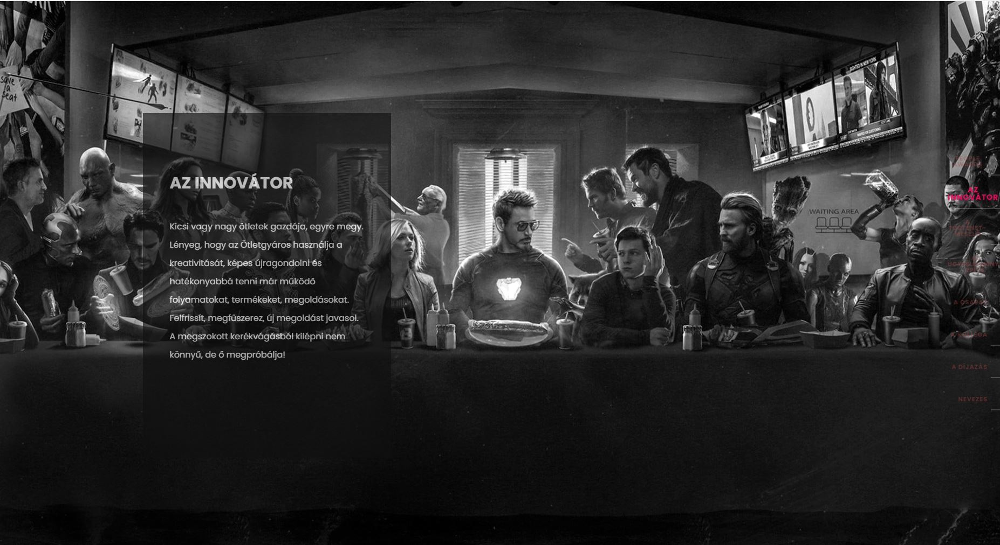

# People Awards 2019

## General Info

People Awards is a very important company event in our international media group Ringier Axel Springer Media, which operates in Eastern and Central Europe. This award ceremony for employees highlights the best individuals and teams, and we also celebrated it in this unusual year!

## Screenhots



## Description

Static bootstrap page for the Ringier Axel Springer Hungary 2019 PEOPLE AWARDS event. 

## Technolgies

+ Bootstrap v3.3.7
+ JQuery 2.2.4
+ Owl carousel
+ Parallax.js v1.4.2
+ Slick js 1.6.0
+ jquery.themepunch.revolution.js 4.6.5

## Setup

To run this project, install it locally using [xampp](https://www.apachefriends.org/hu/index.html) on Windows. On Linux use command
```
chmod 755 xampp-linux-*-installer.run
```
and install it with
```
sudo ./xampp-linux-*-installer.run
```

## Note

Because corporate localhost is only available on desktop, the page is not set up for mobile and tablet views.

## Created

2020

## License

Copyright
